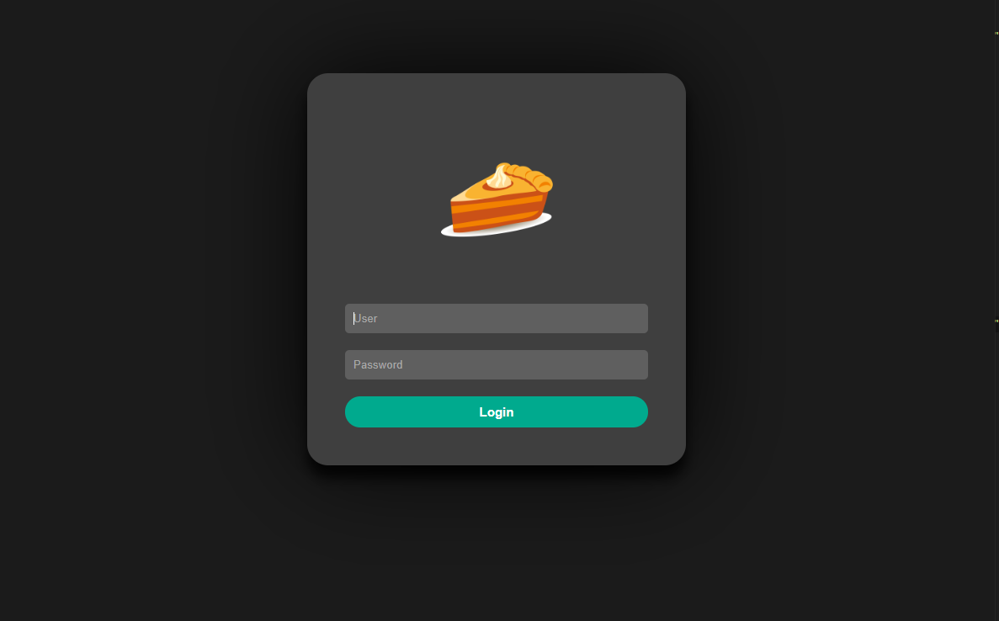
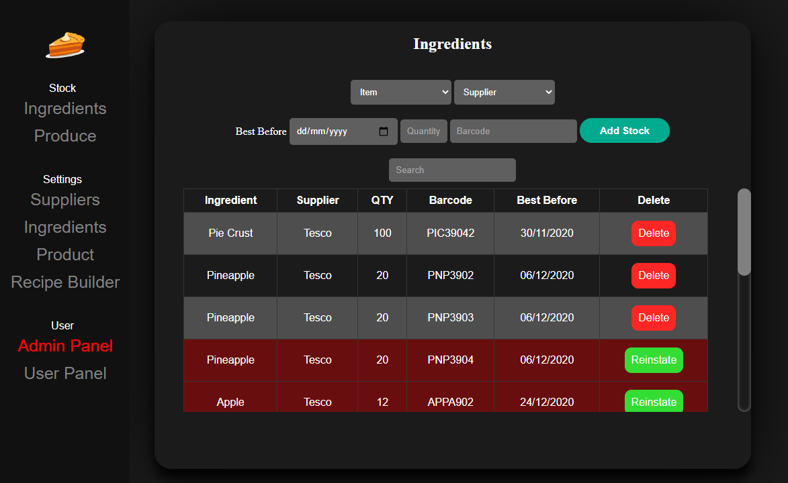

# Stock Management System [WIP]

Localised stock management system built in electron, images are not respective of the final design.

## How to Use

No executable currently available *yet*, runs using NodeJS. For first use from the CMD, cd to the directory then.

`npm install`

To start, run the following from cmd.

`npm start`

Note, while in beta pulling a newer version may require deletion of `pie.db` if database changes are made. This will not be an issue in live.

## Change List

**Version 1.0 (beta)**

### 26/11/2020

* New colour scheme
* Extended search functionality. (Stock - Ingredient can be searched by item name, supplier name, and barcode. "out of date" returns all out of date products, Suppliers can be searched via Name, Address, Phone, and Email)
* Fixed Bug which would show the login screen after creating an account in admin section.
